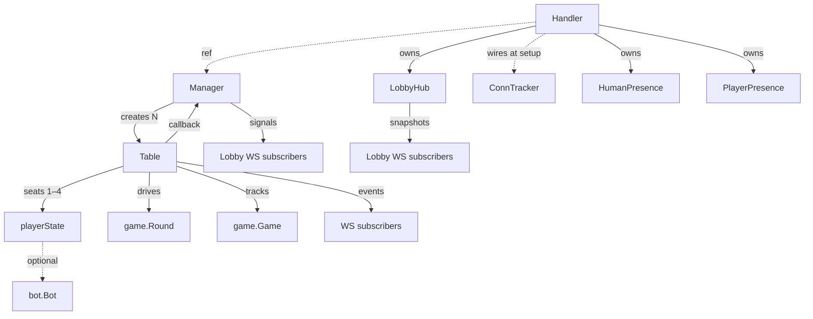

# Architecture

This document is an **explanation** (in the [Divio documentation system](https://docs.divio.com/documentation-system/) sense): it clarifies the design of the web-only Hearts application — the reasoning, constraints, and relationships — rather than serving as a step-by-step guide or API reference.

## Core principles

- Web-only interaction model: players use the browser UI.
- No NATS transport: server and session runtime are in-process.
- The table is the single authoritative owner of Hearts rules, game loop, and scoring.
- Human players and bots use the same command path and validation rules.
- Concurrency uses actor-style goroutines for owned mutable state.
- Runtime state is in-memory only and is lost on process restart.

## UX model

The application has two screens: a **lobby** and a **table**. The lobby is where players pick a name, see who else is around, and create or join tables. The table is the gameplay surface — joining, adding bots, playing cards, and viewing results all happen here. Each screen has its own WebSocket connection for real-time updates.

Each browser tab represents one player identity at one table. A player can have multiple tabs open to the same table (multi-tab), but they occupy a single seat. This matters because the system must distinguish "a tab closed" from "the player left" — which is why connection counting exists at multiple levels (see [Connection lifecycle](#connection-lifecycle)).

## Layer responsibilities

The codebase is split into layers with strict boundaries — higher layers depend on lower ones, never the reverse.

The **web app** (`cmd/hearts`, `internal/webui`) starts the HTTP server, serves embedded assets with content-hash fingerprinting, and manages WebSocket lifecycle. It loads locale JSON files at startup and inlines all translations into every page so the client can resolve the active locale without a round-trip. Locale is determined client-side with a three-level fallback: an explicit user choice in LocalStorage takes priority over the server-provided Accept-Language match, which in turn falls back to English. This ordering exists because multiplayer means different players on the same table may have different locales — the server can't bake a single locale into the shared HTML, so the decision must happen in the browser. It routes messages but makes no game decisions.

The **session runtime** (`internal/session`) is where authority lives. `Manager` handles table lifecycle (create, destroy, list). `Table` is the authoritative runtime for one game session: it assigns player IDs and seats, validates inputs by delegating to `game.Round`, and emits events. The table treats human players and bots identically — both submit commands through the same channel.

The **bot layer** (`internal/game/bot`) provides the `bot.Bot` decision interface. Bots are stateless — they receive a snapshot of the decision context and return a choice. They run as server-side agents but never bypass the table's authority.

The **domain layer** (`internal/game`) owns Hearts rules, scoring, and per-round state. `game.Round` is a step-at-a-time state machine: callers drive phase transitions (`SubmitPass` → `ApplyPasses` → `MarkReady` → `StartPlaying` → `Play`), which gives the session layer hooks for event emission between steps. The domain layer contains no I/O.

## Concurrency model

Every piece of mutable state is owned by exactly one goroutine. There are no shared-state locks on hot paths. Goroutines communicate through channels using the actor pattern: callers send a command (often with an embedded reply channel) and the owning goroutine processes commands sequentially.

This means a `Table` can safely mutate game state, player lists, and subscriptions without coordination — everything is serialized through its command loop. The same pattern applies to `Manager`, `LobbyHub`, and the tracker actors.

## Runtime entity relationships

The system is a tree of actor goroutines that communicate exclusively through channels. Understanding who owns whom and how messages flow is key to reasoning about the runtime.

### Entity graph

### Actors and their purpose

**Handler** (`webui`) is the HTTP/WS entry point. It is not itself an actor but wires everything together: it creates LobbyHub and the tracker actors, and receives Manager from the outside. ConnTracker is also passed in at construction but is not retained as a field — it is forwarded to the WebSocket route handlers during setup.

**Manager** (`session`) owns the table lifecycle. It creates and destroys Tables, and broadcasts a signal to lobby subscribers whenever the table list changes. Tables notify the Manager back via an injected callback when lobby-relevant events occur (player join/leave, round start, game over).

**Table** (`session`) is the heart of the system — one actor goroutine per game session. It seats up to 4 players, drives `game.Round` through its phases, and broadcasts events to WebSocket subscribers. Bot seats are distinguished by having a non-nil `bot.Bot` on the `playerState` (`player.bot != nil`); bots run in short-lived goroutines that submit moves back through the same command channel as human players.

**LobbyHub** (`webui`) tracks which players are present in the lobby and broadcasts presence snapshots to lobby WebSocket subscribers. It ref-counts tokens so that multiple tabs for the same player count as one presence.

**HumanPresence**, **PlayerPresence**, and **ConnTracker** (`webui/tracker`) are lightweight counting actors. HumanPresence counts human connections per table (used to detect orphaned tables). PlayerPresence counts connections per player-per-table (used to detect when a player's last tab closes). ConnTracker tracks all active WebSocket connections so they can be drained during graceful shutdown — it exists because hijacked WebSocket connections survive `http.Server.Shutdown`.

### How messages flow

WebSocket handlers send commands to actors and receive replies through embedded response channels. This is a request/response pattern serialized through the actor's goroutine.

For broadcasting, actors hand out buffered subscriber channels. Manager signals table-list changes, Table pushes game events (with optional per-player filtering), and LobbyHub pushes presence snapshots. Subscribers that fall behind lose messages (non-blocking sends on buffered channels).

The one exception to pure channel communication is the Table → Manager callback. Manager injects an `onChange` function when creating a Table, avoiding a circular dependency while still letting tables notify the lobby of state changes.

### Connection lifecycle

A browser opens **two WebSocket connections** during a session: one to the lobby, one to a table.

The **lobby WebSocket** subscribes to both LobbyHub (presence) and Manager (table list). The client announces itself with a token and name; the WS handler then explicitly calls `Broadcast()` to push the updated presence to all lobby subscribers. This is an asymmetry worth knowing: `Join` does not auto-broadcast (the caller decides when), while `Leave` does. On disconnect, LobbyHub decrements the token's ref count.

The **table WebSocket** subscribes to the Table's event stream and receives an initial state snapshot. When the client sends a "join" command, the Table assigns a seat (or reconnects via token match), and the WS handler registers the connection with HumanPresence and PlayerPresence.

On disconnect, PlayerPresence determines whether this was the player's last tab — only then does the Table hear about the leave. HumanPresence determines whether any humans remain — if not, a detached goroutine starts a grace-period timer (60 s if the table has started, 500 ms otherwise) and then asks the Manager to destroy the table. This orphan-cleanup goroutine is one of the few places where work happens outside the actor tree — it is a fire-and-forget timer, not an actor. The two-level counting is what makes multi-tab play and graceful disconnection work.

## State and persistence

All state lives in memory and is lost on process restart. This is a deliberate simplification — there is no database, no session store, no replay log.

Reconnection within a running process works via browser tokens: the token is a stable identifier that lets a player reclaim their seat after a network blip or page reload. But once the process restarts, all identity is gone.

## Authority and validation

The session runtime is the single source of truth for game actions. It assigns player IDs, validates every move against `game.Round`, and decides outcomes. Clients may pre-validate for UX responsiveness, but the server's decision is final. This keeps the trust boundary simple: nothing outside the session runtime can alter game state.

## Frontend resilience

The browser client retries on transient, potentially recoverable failures (network blips, brief server unavailability) before giving up. Terminal conditions (server explicitly rejects the request) fail fast. The goal is to avoid bouncing users out of a game due to a momentary glitch while still redirecting promptly when the resource is genuinely gone.

## Logging

Logs are emitted via `log/slog` with a JSON handler to stdout. The log level is controlled by the `-log-level` CLI flag or the `LOG_LEVEL` environment variable (default: `info`; the container image defaults to `warn`).

The intent is that `info` covers the lifecycle events an operator cares about (table and player lifecycle), `warn` flags situations that may need attention (orphaned tables), and `debug` captures detail useful during development (bot additions).
